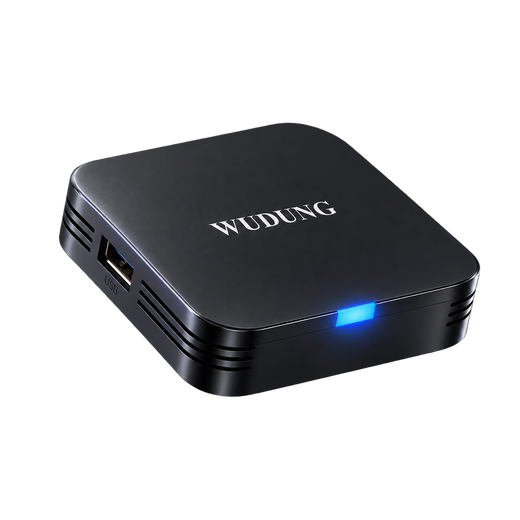

<p align="center">
  <a href="https://share.temu.com/7g4eht8xY2B">
    
  </a>
</p>

<h1 align="center">Mainline Linux on the Wudung W01</h1>

<p align="center"><b>Arch Linux ARM on a cheap Allwinner H313 TV box, booting from its own eMMC.</b></p>

<p align="center">
  
  
  
  
</p>

<p align="center">
  <a href="#part-2-install-u-boot-onto-the-box">Install</a> &middot;
  <a href="#part-5-first-boot-wifi-and-ssh">WiFi</a> &middot;
  <a href="#recovering-a-box-that-will-not-boot">Recovery</a> &middot;
  <a href="https://github.com/MultiX0/wudung-w01-linux/releases">Releases</a> &middot;
  <a href="#for-ai-assistants">For AI assistants</a>
</p>

---

No SD card slot, no SPI flash, no exposed UART, and a single USB port that is
the only way in. That combination is why the usual Allwinner recipes do not
apply to this box. This repository is one that does, including working WiFi.

**Where to get one:** this was developed on a Wudung W01 bought from
[this exact Temu listing](https://share.temu.com/7g4eht8xY2B). Any of the
boxes below is the same board, but that is the one every command here was
tested against. Click the picture above to go to it.

Hardware-identical boxes this also applies to:

| Name | Notes |
|---|---|
| Wudung W01 | what this was developed on, [Temu listing](https://share.temu.com/7g4eht8xY2B) |
| Tanix TX1 | same PCB, `CS_H313_TX1_EMCP_V1.1` and `QHZIW_H313_TX1_EMCP_V2.0` |
| Vontar QTV Q1 | same board |

| | |
|---|---|
| SoC | Allwinner H313 (`sun50iw9p1`), a binned H616, reports FEL id `0x1823` |
| CPU | Quad Cortex-A53, ARMv8, 64-bit |
| RAM | 1 to 2 GiB LPDDR3 |
| Storage | eMMC only, about 15 GiB. No SD slot. No SPI flash. |
| USB | One USB 2.0 type-A port, which doubles as the FEL port (FEL is the USB recovery mode built into the chip itself, and cannot be erased) |
| PMIC | AXP313 |
| WiFi | **AltoBeam ATBM6031**, SDIO `007a:6011`, chip id reports `6032i`. Works, see [Part 5](#part-5-first-boot-wifi-and-ssh). |
| WiFi antenna | single chain, 1T1R, 2.4 GHz only. No 5 GHz radio on this board. |
| Bluetooth | present in hardware (combo part), not covered here |
| MMC numbering | mmc0 unused (no SD slot), mmc1 is the SDIO WiFi, mmc2 is the eMMC and appears as `mmcblk2` |

Note the WiFi part. The device tree in every image floating around calls it
`smartchip,s9083s`, and that is wrong. The chip only ever answers to SDIO
vendor `0x007a`, which is AltoBeam. The `s9083s` driver has to be removed or
it claims the device and the real driver never sees it.

End result: Arch Linux ARM booting from eMMC to a login prompt on HDMI, with
working WiFi, SSH, and the USB port free for a keyboard.

**Warning.** This replaces the Android bootloader on the eMMC, so Android will
stop booting. You can put it back, see [Restoring stock
Android](#restoring-stock-android), but read that section before you start
rather than after.

---

## What you need

Hardware:

* The box, its power supply, and an HDMI cable to a TV or monitor.
* A USB A-to-A male-to-male cable, meaning both ends are the normal flat
  rectangular plug. This is not a common cable and you probably have to buy
  one. A normal phone charging cable will not work.
* A toothpick or similar thin plastic stick.
* A USB flash drive, 4 GB or larger.
* A USB keyboard.
* Optionally a small USB hub. The box has one USB port and the guide never
  needs two things plugged in at once, but a hub is handy.

Software: a Linux PC, or Windows 10/11 with WSL2. Setup for both is below.

---

# Part 1: Set up your PC

Follow either the Linux or the Windows section, not both.

## Linux

```bash
sudo apt update
sudo apt install -y sunxi-tools git curl
```

That is Debian and Ubuntu. The package is called `sunxi-tools` on Fedora too;
on Arch it is in the AUR.

Skip ahead to [Part 2](#part-2-install-u-boot-onto-the-box).

## Windows 10 / 11

You need two things: WSL2 (a real Linux environment) and usbipd-win (which
passes USB devices from Windows into WSL2).

### Step 1. Open PowerShell as Administrator

This matters. Several commands below fail with "Access denied" in a normal
window.

Press the Start button, type `PowerShell`, right click **Windows PowerShell**,
and choose **Run as administrator**. Click Yes on the prompt. The window title
must say "Administrator".

### Step 2. Install WSL2 and usbipd-win

In that Administrator PowerShell window:

```powershell
wsl --install -d Ubuntu
```

If it asks you to reboot, reboot, then continue. The first launch of Ubuntu
asks you to create a username and password. That password is for Linux, it can
be anything you will remember, and it will not show any characters as you type
it.

Still in Administrator PowerShell:

```powershell
winget install --exact --id dorssel.usbipd-win
```

Close PowerShell and open a new Administrator PowerShell window so the new
command is on the path.

### Step 3. Install the tools inside Ubuntu

Open Ubuntu from the Start menu and run:

```bash
sudo apt update
sudo apt install -y sunxi-tools git curl
```

### Step 4. How to attach the box to WSL2

You will repeat this every single time the box reboots or re-enters FEL mode,
because it re-enumerates as a new USB device each time.

In **Administrator PowerShell**:

```powershell
usbipd list
```

Look for a line with `1f3a:efe8`. Note its BUSID, for example `1-2`. Then, the
first time only:

```powershell
usbipd bind --busid 1-2
```

And every time you want to use it from Ubuntu:

```powershell
usbipd attach --wsl --busid 1-2
```

Replace `1-2` with your actual BUSID. `bind` needs Administrator. `attach` does
not, but it is easiest to keep using the same Administrator window.

---

# Part 2: Install U-Boot onto the box

Every command from here on runs in **Linux** (Ubuntu on WSL2 if you are on
Windows), unless it says PowerShell.

## Step 1. Download the files

```bash
mkdir -p ~/w01 && cd ~/w01
git clone https://github.com/MultiX0/wudung-w01-linux.git
```

The binaries you need are in `wudung-w01-linux/prebuilt/`, so cloning is
enough. They are also attached to the Releases page if you prefer.

## Step 2. Put the box into FEL mode

Video showing how to enter FEL mode: *(placeholder, link to be added)*

1. Unplug the box from power completely.
2. Push a toothpick into the 3.5 mm A/V jack. There is a recessed button
   inside. Press and hold it.
3. While still holding, plug the USB A-to-A cable from the box into your PC.
4. Keep holding for about 2 seconds, then release.

Windows only, in Administrator PowerShell:

```powershell
usbipd list
usbipd attach --wsl --busid 1-2
```

Then check it worked, in Linux:

```bash
sudo sunxi-fel ver
```

You should see a line containing `soc=00001823(H616)`.

`sudo` is needed. A USB device passed into WSL2 by usbipd is owned by root and
the `sunxi-tools` package installs no udev rule, so without `sudo` you get
`ERROR: Allwinner USB FEL device not found!` even when the box is sitting
there in FEL mode perfectly. Every `sunxi-fel` command in this guide needs it.

If you do get that error with `sudo`, the box is genuinely not in FEL mode.
Unplug it and repeat this step.

## Step 3. Install U-Boot

This uses the clone you made in [Step 1](#step-1-download-the-files). If you
put it somewhere else, change the path to match:

```bash
cd ~/w01/wudung-w01-linux/scripts
sudo ./fel-install-uboot.sh
```

It takes a few seconds.

With no arguments it uses the binaries in `../prebuilt/`, which is what you
want. Pass paths explicitly only if you built your own.

Wait for this line:

```
SUCCESS - U-Boot is installed and verified byte-for-byte.
```

Do not continue unless you see it.

---

# Part 3: Boot Linux from a USB stick

## Step 1. Download the MiniArch image

This image is somebody else's work, see [Credits](#credits).

The asset is xz-compressed, so it has to be unpacked before writing. Note the
`-f` on curl: without it, curl writes a "404 Not Found" page into the `.img`
file, exits successfully, and you find out only when the box refuses to boot.

```bash
cd ~/w01
curl -fLO https://github.com/warpme/miniarch/releases/download/172667447a9/MiniArch-15.2.0-06.06.2026-7.1.1-board-h313.tanix_tx1-SD-Image.img.xz
unxz MiniArch-15.2.0-06.06.2026-7.1.1-board-h313.tanix_tx1-SD-Image.img.xz
ls -lh MiniArch-*.img
```

The download is about 194 MiB and expands to roughly 3 GiB, so `ls` must show
a multi-gigabyte file. If it shows a few kilobytes, the download failed.

That release tag is a commit hash and MiniArch will publish newer ones. If the
link is dead, take the newest `board-h313.tanix_tx1` asset from the
[MiniArch releases page](https://github.com/warpme/miniarch/releases). Pick
`tanix_tx1`, not one of the `x96_q` variants.

**If you use a newer image, the prebuilt WiFi driver will not load.** Kernel
modules are checked against the exact kernel version at load time, and the one
in the release is built for 7.1.1. A newer image installs fine and then has no
WiFi, which you cannot fix from the box because it has no network. Either stay
on the pinned image, or rebuild the driver for your kernel with
[`build-atbm-driver.sh`](#building-from-source) and put the result in the
bundle before running `prepare-usb.sh`.

## Step 2. Write it to the USB flash drive

On Windows, first attach the flash drive to WSL2. In Administrator PowerShell,
find its BUSID with `usbipd list` (it will say "USB Mass Storage Device"), then:

```powershell
usbipd bind --busid 1-1
usbipd attach --wsl --busid 1-1
```

Replace `1-1` with the BUSID that `usbipd list` shows for the flash drive. It
is a different device from the box, so it has a different BUSID.

Now find the drive in Linux:

```bash
lsblk
```

On the machine this was developed on the flash drive came up as `/dev/sdg`,
and that is the letter used in the command below. **Yours will almost
certainly be a different letter.** Look at the `lsblk` output and find the
device whose size matches your flash drive. It looked like this here:

```
sdg      8:96   1  14.6G  0 disk
```

`dd` erases whatever you point it at, without asking, and pointing it at the
wrong disk destroys that disk. Check the letter before you press Enter, and
use the whole drive (`/dev/sdg`), not a partition (`/dev/sdg1`):

```bash
sudo dd if=MiniArch-15.2.0-06.06.2026-7.1.1-board-h313.tanix_tx1-SD-Image.img \
        of=/dev/sdg bs=4M status=progress conv=fsync
sync
```

Change `sdg` to your own letter first. It takes a few minutes, and
`status=progress` will appear to stall at the end while `conv=fsync` flushes.
That is normal, wait for the prompt.

Then make the kernel re-read the new partition table, or the next step fails
with "special device does not exist":

```bash
sudo partprobe /dev/sdg || sudo blockdev --rereadpt /dev/sdg
lsblk /dev/sdg
```

You should now see two partitions. On WSL2, if they still do not appear,
`usbipd detach` and `usbipd attach` the drive again.

## Step 3. Prepare the stick

One command does everything the stick needs: it points the kernel at the USB
root, turns on video output, and installs the WiFi driver, its firmware, `iw`,
`wpa_supplicant`, the `wifi` command and the eMMC installer into the stick's
root filesystem.

That last part matters. The eMMC installer copies the whole root filesystem
across, so the WiFi driver lands on the eMMC with everything else. The box
ends up with working WiFi without you ever having to install anything on it.

```bash
cd ~/w01/wudung-w01-linux/scripts
sudo ./prepare-usb.sh /dev/sdg
```

Same drive letter as the `dd` step, the whole drive and not a partition. It
downloads the WiFi bundle from the Releases page automatically; if you have
no internet on this PC, download `w01-wifi-*.tar.gz` yourself and pass it:

```bash
sudo BUNDLE=~/Downloads/w01-wifi-v1.1.tar.gz ./prepare-usb.sh /dev/sdg
```

It refuses to touch a drive that does not look like the MiniArch image, and
finishes with `Stick is ready.`

---

# Part 4: Install onto the eMMC

## Step 1. Boot the stick once

1. Unplug the USB stick from the PC and plug it into the box.
2. Connect HDMI if you want to watch. It is not required.
3. Power the box on normally, with no toothpick this time.

The stick boots Linux and immediately installs it onto the eMMC. You do not
need a keyboard: it formats two eMMC partitions, copies the whole system
across including the WiFi driver, disables itself on the stick once the copy
has succeeded so a stick left plugged in cannot wipe the new install, and then
**switches the box off** when it is done.

That takes a few minutes, and the box powering itself off is the signal that
it worked.

If the box stays on and sits at a login prompt instead, something failed. Put
the stick back in your PC and read `emmc-install.log` on the first partition,
which says exactly what went wrong.

## Step 2. Boot standalone

Unplug the USB stick, leave it out, and power the box on.

It boots Arch Linux ARM from its own eMMC. The USB port is now free for a
keyboard.

---

# Part 5: First boot, WiFi and SSH

The driver, its firmware, `iw`, `wpa_supplicant` and the `wifi` command are
already on the box. They were injected into the stick in Part 3 and copied to
the eMMC in Part 4. Nothing needs installing here.

You need the box, its power supply, HDMI, and a keyboard. The USB stick is not
needed again.

## Step 1. Log in and set a password

Power the box on. When it reaches:

```
Arch Linux ARM 7.1.1 (tty1)
alarm login:
```

log in as `root`, password `root`.

SSH is enabled and root login is permitted, both set up in Part 3. If
`prepare-usb.sh` had found `openssh` missing from the image it would have
stopped and told you, so if it printed `Stick is ready.` this is in place.

That means the box is reachable from anything on your network the moment it
has an address. Change the password before that happens:

```bash
passwd
```

## Step 2. See which networks are in range

```bash
wifi scan
```

You get one SSID per line:

```
MyNetwork
HomeNet-2.4G
Neighbour-WiFi
```

If the list is empty, or you get `No wireless interface found`, the driver did
not come up. Jump to [WiFi troubleshooting](#wifi-troubleshooting); in almost
every case the answer is a cold power cycle.

Only 2.4 GHz networks appear. This board has no 5 GHz radio, so a 5 GHz-only
SSID will never show up.

## Step 3. Connect

```bash
wifi connect
```

It scans again, then asks:

```
SSID: MyNetwork
Password:
```

Type the SSID exactly as it appeared in the scan, case included. The password
is hidden as you type. It then associates, requests an address, and prints
what it got.

Nothing else is needed. `wifi connect` enables `wpa_supplicant@<interface>`
and `dhcpcd@<interface>` as systemd services, so the box reconnects by itself
on every boot and whenever the link drops.

The interface name comes from udev and is not the same on every box. Here it
came up as `wld0`, not `wlan0`. You never need to type it: every `wifi`
subcommand finds it for you.

## Step 4. Check it actually works

```bash
wifi
```

which prints the link and the address:

```
interface : wld0
  Connected to aa:bb:cc:11:22:33 (on wld0)
  SSID: MyNetwork
  freq: 2447.0
  signal: -61 dBm
  rx bitrate: 19.5 MBit/s MCS 2
  tx bitrate: 1.0 MBit/s

  IP address: 192.0.2.8
  ssh root@192.0.2.8
```

Then confirm you can reach the internet, not just the router:

```bash
ping -c 5 1.1.1.1
```

Replies mean routing works. If that succeeds but names do not resolve, test
DNS separately:

```bash
ping -c 3 archlinuxarm.org
```

Reading the output:

| What you see | What it means |
|---|---|
| `Connected to ...` and an IP | working |
| `not connected` | association failed, check the password and re-run `wifi connect` |
| Connected but no IP | DHCP failed. `systemctl restart dhcpcd@wld0` with your own interface name |
| `ping 1.1.1.1` works, names fail | DNS. Check `cat /etc/resolv.conf` |
| `Network is unreachable` | no address at all, treat as the "no IP" row |

Some packet loss on `ping` is expected on this hardware, see
[Known issues](#known-issues). The low `tx bitrate` above is real and is the
open problem described there. TCP tolerates it: in testing SSH connected on
every attempt, though handshakes took anywhere from 0.4 to 5.5 seconds.

## Step 5. SSH in from your PC

```bash
ssh root@192.0.2.8
```

with the address `wifi` printed. It is also shown on the login screen before
you log in, so a headless box tells you where it is.

From here you can unplug the keyboard and the HDMI cable and work over SSH.

## Step 6. Give it a fixed address, optional

DHCP may hand out a different address after a reboot, which is annoying for a
headless box. To pin one:

```bash
wifi static 192.0.2.50
```

Pick an address on your own network: keep the first three numbers the same as
the one DHCP gave you, and choose a last number outside your router's DHCP
pool (high ones like `.50` or `.200` are usually safe).

The gateway is taken from the current default route. DNS is set to that
gateway plus `1.1.1.1` as a fallback. Both are written to `/etc/dhcpcd.conf`
between the `# w01-static` and `# w01-static-end` markers and applied at once.
It is written to survive reboots.

This is the one step in this guide that was not tested on real hardware. It
follows dhcpcd's documented mechanism, but if you are working headless, have a
keyboard and HDMI to hand before running it: it restarts the interface, and if
the address does not come back you will need the console. `wifi dhcp` undoes
it.

Back to automatic:

```bash
wifi dhcp
```

---

# Part 6: Best practices after the install

Do these once, in this order, on a freshly installed box.

## Fix the clock first

Package signatures are time-sensitive. If the clock is wrong, every signature
looks invalid and you will chase the wrong problem:

```bash
timedatectl set-ntp true
timedatectl status
```

Check the date is right before going on. The box has no RTC battery, so it
starts from whatever the image was built with until NTP fixes it, and NTP
needs the network from Part 5.

## Repair the pacman keyring

On a fresh MiniArch image `pacman` will usually fail like this:

```
error: m4: signature from "Arch Linux ARM Build System <builder@archlinuxarm.org>" is unknown trust
:: File /var/cache/pacman/pkg/m4-1.4.21-2-aarch64.pkg.tar.xz is corrupted
   (invalid or corrupted package (PGP signature)).
```

Read that carefully, because it is misleading. The download is fine and the
package is almost certainly not corrupted. The key it is signed with is
present but **not trusted**, so pacman refuses to install. Note that
`checking keys in keyring` and `checking package integrity` both reported
100% just above it.

Arch Linux ARM signs packages with the build system key
`68B3537F39A313B3E574D06777193F152BDBE6A6`. Rebuild the local trust database:

```bash
rm -rf /etc/pacman.d/gnupg
pacman-key --init
pacman-key --populate archlinuxarm
rm -f /var/cache/pacman/pkg/*.pkg.tar.*
pacman -Syu
```

`--populate` should print `Appending keys from archlinuxarm.gpg`, then
`Locally signing trusted keys in keyring`, then `Importing owner trust
values`. Clearing the cache matters: the half-downloaded packages from the
failed run are still there and will be rejected again.

If `--populate archlinuxarm` says the keyring does not exist, check:

```bash
ls -l /usr/share/pacman/keyrings/
```

You want `archlinuxarm.gpg` and `archlinuxarm-trusted`. If they are missing,
the keyring package itself is absent and you need
`pacman -S archlinuxarm-keyring` first, which is awkward because that is the
thing that is broken. In that case install it with signature checking off for
that one command:

```bash
pacman -S --config <(sed 's/^SigLevel.*/SigLevel = Never/' /etc/pacman.conf) archlinuxarm-keyring
```

then re-run the `pacman-key` steps above.

**Do not** simply set `SigLevel = Never` or `TrustAll` in `/etc/pacman.conf`
and leave it there. That disables signature verification permanently for
everything you ever install. It is the wrong fix and the ArchWiki advises
against it. Repairing the keyring is a one-time job.

## Update, then install what you want

One thing to know first: `iw` and `wpa_supplicant` were unpacked onto the
stick directly rather than installed through pacman, because the PC preparing
the stick has no pacman. Pacman therefore does not know it owns those files.
If a later install pulls one of them in as a dependency it will stop with
`exists in filesystem`. Resolve it by letting pacman take ownership:

Always `-Syu`, never `-Sy` followed by `-S`. A partial upgrade on Arch breaks
the system sooner or later:

```bash
pacman -Syu
pacman -S wget nano htop fastfetch
```

If a package pulls in `iw` or `wpa_supplicant` and stops with
`exists in filesystem`, let pacman take ownership of the files that were
unpacked onto the stick:

```bash
pacman -Syu --overwrite '/usr/*' iw wpa_supplicant
```

`fastfetch` is a quick way to confirm the system is what you think it is:

```bash
fastfetch
```

## Firewall

The box has SSH open with root login, so a firewall is worth having. `ufw`
does not work out of the box on this image, and the failure is confusing, so
read this before running it.

### Point iptables at the legacy backend first

```bash
pacman -S ufw
for b in iptables iptables-restore iptables-save \
         ip6tables ip6tables-restore ip6tables-save; do
    ln -sf xtables-legacy-multi /usr/bin/$b
done
printf 'ip_tables\niptable_filter\nip6_tables\nip6table_filter\n' \
    > /etc/modules-load.d/iptables-legacy.conf
modprobe ip_tables iptable_filter ip6_tables ip6table_filter
iptables --version
```

That last line must say `(legacy)`. Without this step every ufw command fails
with a wall of errors like:

```
[Errno 2] iptables v1.8.13 (nf_tables): TABLE_ADD failed (Operation not supported): table filter
ERROR: problem running ufw-init
Problem running '/etc/ufw/before.rules'
```

The reason: Arch ships `/usr/bin/iptables` as a symlink to
`xtables-nft-multi`, so iptables drives nf_tables. This kernel builds
`nf_tables` itself but **not the IPv4 or IPv6 families for it**
(`CONFIG_NF_TABLES_IPV4` is not set, and `nft_chain_filter.ko` and
`nf_tables_ipv4.ko` are not in `/lib/modules`). You can confirm the kernel is
at fault rather than ufw:

```bash
nft add table ip testtbl
# Error: Could not process rule: Operation not supported
```

The legacy netfilter path is fully built and works, which is why switching the
symlinks fixes it.

### Then enable it

```bash
ufw allow 22/tcp
ufw --force enable
systemctl enable ufw
ufw status verbose
```

`ufw allow 22/tcp` must come **before** enabling, or you lock yourself out of
your own box the moment the rules load. If you are working over SSH rather
than at the keyboard, give yourself an undo before enabling anything:

```bash
setsid nohup sh -c "sleep 300; ufw --force disable" >/dev/null 2>&1 &
```

That turns the firewall back off after five minutes whether or not you are
still connected. Kill it with `pkill -f "sleep 300"` once you have confirmed
you can still get in.

A working result looks like this:

```
Status: active
Default: deny (incoming), allow (outgoing), disabled (routed)

To                         Action      From
--                         ------      ----
22/tcp                     ALLOW IN    Anywhere
22/tcp (v6)                ALLOW IN    Anywhere (v6)
```

Ping still works afterwards: ufw's default rules accept ICMP echo.

**One thing to watch.** Those symlinks belong to the `iptables` package, so a
future `pacman -Syu` that upgrades it will point them back at nft and ufw will
break again with the same errors. If that happens, re-run the symlink loop
above. Nothing else is lost, your rules are kept in `/etc/ufw`.

## Optional tidying

Silence the harmless regulatory warning in `dmesg`:

```bash
pacman -S wireless-regdb
```

Free the space taken by the package cache once things are working:

```bash
pacman -Sc
```

## The `wifi` command

```
wifi                     status and IP address
wifi scan                list nearby networks
wifi connect             pick a network and save it
wifi static 192.0.2.50  pin a static IP (defaults to /24)
wifi dhcp                back to automatic addressing
wifi forget              remove the saved network
```

`myip` prints the current addresses.

See [Part 5 Step 6](#step-6-give-it-a-fixed-address-optional) for what
`wifi static` writes.

## WiFi troubleshooting

| Symptom | Cause and fix |
|---|---|
| `No wireless interface found` | Driver did not load. `dmesg \| grep -i atbm \| tail`. |
| Interface exists, will not come up | Almost always a **warm reboot**. Pull the power for 30 seconds. See below. |
| `mmc1: error -5 whilst initialising SDIO card`, or `Card stuck being busy` | Same thing. The chip did not re-enumerate. Cold boot. |
| Connects, then drops repeatedly | You are on an older driver build. Use the one in the release. |
| `cfg80211: failed to load regulatory.db` | Harmless. |

### The cold boot rule

**This chip only initialises from a cold power-on.** After any `rmmod`, warm
`reboot`, or a driver crash, it stays in whatever state it was left in and
`mmc1` fails to re-enumerate it. Rebooting Linux does not power-cycle the
chip. Only removing power does.

If WiFi is missing after a reboot, pull the power cord for 30 seconds. This is
not a suggestion, it is the single most common cause of "it stopped working"
and it cost several hours of misdiagnosis here.

---

## Restoring stock Android

If you want Android back, or something went wrong:

1. Download the stock firmware,
   [`Wudung_W01_20250616_1449.rar`](https://github.com/MultiX0/wudung-w01-linux/releases/download/v1.0/Wudung_W01_20250616_1449.rar),
   and extract the `.img` file inside it.
2. Install PhoenixSuit on a Windows PC. PhoenixSuit is Allwinner's own
   flashing tool, not part of this project. There is no official download, so
   the copy used here came from a third-party mirror,
   <https://legione.name/upload/?dir=Smart-TV-Box/Q1/> (`PhoenixSuit_EN.msi`).
   It is an unsigned installer from a personal file host: check it against
   your own antivirus before running it, or source it from somewhere you
   trust more. Nothing else in this guide needs it.
3. Open PhoenixSuit, go to the Firmware tab, and select the `.img` file.
4. Put the box into FEL mode using the same toothpick procedure as above.
5. PhoenixSuit detects the box and offers to flash it. Accept.

This rewrites the whole eMMC, so it undoes everything in this guide.

The box is very hard to brick permanently. FEL mode lives in mask ROM inside
the SoC and cannot be erased by anything you write to the eMMC, so the
toothpick recovery has brought back every failure seen while writing this,
including a box that crashed on every boot with an unusable console.

---

## Troubleshooting

**`sunxi-fel` says no FEL device found.** On Windows, the most common cause is
forgetting to run `usbipd attach` after the box re-enumerated. Run
`usbipd list` in Administrator PowerShell and check the state of the device.

**`usbipd bind` says access denied.** The PowerShell window is not elevated.
Close it and open a new one with Run as administrator.

**`usbipd list` shows `Unknown USB Device (Device Descriptor Request Failed)`.**
The board firmware has crashed. Only a physical power cycle recovers it. Unplug
the box, then redo the FEL procedure.

**`usbipd list` shows the device as Attached but `sunxi-fel` times out.** The
listing can be stale. Run `usbipd detach --busid 1-2`, check the list again,
and if it now shows the failed-descriptor state, power cycle the box.

**The screen stays black after installing U-Boot.** That is expected. U-Boot
has no HDMI driver on this SoC, so nothing appears until the Linux kernel
starts. If the kernel never starts you will see nothing at all, which is why
step 3 of Part 2 verifies the install over USB instead of relying on the
screen.

---

# How it works, and how this was worked out

Everything below is background. You do not need it to follow the instructions
above.

## The core problem

The Allwinner BROM tries to boot in this order: SD card, then eMMC, then SPI
NOR, then USB FEL. This box has no SD slot and no SPI flash, so there are
exactly two possibilities: whatever is on the eMMC, or FEL recovery mode.

Mainline support already existed. `tanix_tx1_defconfig` landed in U-Boot
v2024.10-rc3 and `sun50i-h313-tanix-tx1.dtb` in Linux 6.10, both from Andre
Przywara. So why had nobody actually booted one of these?

Because the obvious approach cannot work. `sunxi-fel uboot` with a normal
64-bit build always dies like this:

```
=> Executing the SPL... done.
usb_bulk_send() ERROR -7: Operation timed out
```

U-Boot's own `board/sunxi/README.sunxi64` explains why:

> As the FEL mode is controlled by the boot ROM, it expects to be running in
> AArch32. For now the AArch64 SPL cannot properly return into FEL mode, so
> the feature is disabled in the configuration at the moment.

DRAM initialisation succeeds. The handoff back to the 32-bit BROM is what
breaks. On a board with an SD slot this does not matter, because you just write
an image to a card. Here it is fatal: FEL is the only way in, and the only
thing FEL can run cannot come back.

## The way through

Andre Przywara published a
[patch](https://gist.github.com/apritzel/573e1607b255f23ee025837379d8c706)
that builds the H616 SPL as 32-bit ARM. A 32-bit SPL can return to FEL.

That turns FEL into a usable code execution channel, which is all that is
needed. Run a throwaway 32-bit SPL over USB whose only job is to write a real
64-bit U-Boot into the eMMC. After that the box boots from eMMC normally and
the 32-bit build is never used again.

That is what `patches/0002-fel-emmc-tool.patch` does.

## Things that cost hours

Documented so nobody repeats them.

**The patch only applies to tag `v2025.07`.** Against current master,
`arch/arm/mach-sunxi/Kconfig` has drifted and `board_init_f` has moved. `git
apply` is atomic, so nothing applies at all, and the build then cheerfully
compiles arm64 assembly with a 32-bit toolchain and produces thousands of
`Error: ARM register expected`.

**`CONFIG_SUNXI_DRAM_MAX_SIZE` silently truncates to zero.** Kconfig has
`default 0x100000000 if MACH_SUN50I_H616`, but in a 32-bit build `phys_size_t`
is 32 bits, so it becomes `0`. Then in `board/sunxi/board.c`:

```c
if (gd->ram_size > CONFIG_SUNXI_DRAM_MAX_SIZE)
        gd->ram_size = CONFIG_SUNXI_DRAM_MAX_SIZE;   /* becomes ram_size = 0 */
```

U-Boot proper then believes it has no RAM. gcc does warn about it
(`changes value from '4294967296' to '0'`) but it is buried in the build log.
This cannot be fixed in `.config` either, because the symbol has no prompt, so
`make oldconfig` puts the broken default straight back. The Kconfig itself has
to be patched.

**`find_mmc_device()` hangs the CPU on the FEL path.** It walks a static list
in `drivers/mmc/mmc_legacy.c` that only `mmc_initialize()` ever sets up.
Nothing calls that when booting through FEL, so the list head is uninitialised
garbage, walking it dereferences a bogus pointer, and the CPU traps. With no
UART that is a completely silent hang. The fix is to call `mmc_initialize(NULL)`
first. This one cost the most time, because every failed attempt looked
identical from outside: the board vanishes from USB and needs a power cycle.

**`CONFIG_SPL_MMC_WRITE` is off by default and writes fail silently.** With it
disabled, `mmc_bwrite()` resolves to a stub in `drivers/mmc/mmc_private.h` that
just returns 0. The header literally describes them as "dummies to reduce code
size". So the write appears to succeed, reports zero sectors written, and never
touches the hardware.

**This BROM ignores the eMMC hardware boot partitions.** The documented
approach is `mmc partconf 1 1 1 1` to boot from `mmcblk2boot0`. Doing that and
reading `BOOT_PARTITION_ENABLE` back confirmed it was set, and Android still
booted. Dumping the raw eMMC showed why: the stock bootloader lives at LBA 16,
that is 8 KiB, in the user area, in Allwinner TOC0 format, and that is the only
place this BROM looks. The hardware boot partitions were blank and unused the
whole time.

**A plain eGON image is rejected, it has to be TOC0.** The first user-area
write used the default eGON container. The BROM silently refused it and fell
back to FEL. Rebuilding with `CONFIG_SPL_IMAGE_TYPE_SUNXI_TOC0`, self-signed
because the `ROTPK_HASH` eFuse is blank and therefore any key is accepted,
worked immediately.

**`sunxi-fel write` to a DRAM address needs DRAM to exist.** Obvious in
hindsight. Uploading the payload to `0x50000000` straight after power-on fails
with `ERROR -7`, because nothing has initialised the memory controller yet. The
SPL has to run once first, and only then can the payload be uploaded. That is
why `fel-install-uboot.sh` runs the SPL twice.

**U-Boot only scans partitions flagged bootable.** `scan_dev_for_boot_part`
uses `part list ... -bootable`, which filters on the GPT LegacyBIOSBootable
attribute. The repurposed Android partition did not have it, so U-Boot quietly
fell back to `devplist=1` and scanned partition 1, which is Android's unrelated
`bootloader` partition, and found nothing. It came down to one attribute bit.

**Do not let the installer copy itself.** The eMMC install script gets copied
into the new root filesystem along with everything else. If its systemd unit is
still enabled at the moment of copying, the copy runs on the first eMMC boot,
tries to reformat the filesystem it is running from, fails safely, and powers
the box off right before the login prompt, forever. `install-to-emmc.sh`
deletes itself from the destination to prevent this.

## Layout

The stock GPT is left completely alone. It is an unusual 17-entry table with
`first-lba = 73728`, and letting any normal partitioning tool rewrite it with
the standard 128-entry layout would put the entry array straight over the
bootloader at LBA 16. Instead, two existing Android partitions are simply
reformatted:

| Where | Was | Now |
|---|---|---|
| LBA 16, 8 KiB | Android TOC0 bootloader | 64-bit U-Boot and TF-A, TOC0 format |
| `mmcblk2p7`, 1.5 G | `cache` | `/boot`, ext4, LegacyBIOSBootable set |
| `mmcblk2p17`, 10.9 G | `UDISK` | `/`, ext4 |

Everything between LBA 16 and LBA 73728 is unallocated, about 36 MiB, so the
780 KiB bootloader fits with room to spare and no partition data is at risk.

## How the WiFi was worked out

There was no driver for this chip on mainline Linux, and the starting
information was wrong. This is what it actually took, because the dead ends
are as useful as the answer.

**The chip is not what the device tree says.** Every image calls it
`smartchip,s9083s`. The SDIO bus reports vendor `0x007a`, device `0x6011`.
`0x007a` is AltoBeam. The stock Android `init.rc` confirms it: it loads
`/vendor/modules/atbm613x_wifi_sdio.ko` from a source tree called
`atbm6132bs`. The driver to use is
[gtxaspec/atbm60xx](https://github.com/gtxaspec/atbm60xx), a CW1200 "Apollo"
derivative.

**The open-source driver's firmware does not run on this board.** The repo
ships `svn14195`. It loads and the chip executes it, but the WSM startup
handshake never completes, giving an endless `wsm_startup_done timeout` and
firmware reload loop. The blob that works is the one from the box's own
Android: `lmac 19040`, label `=MODEM==SDIO=-NoBle-`, built Dec 2023.
Getting it out means unpacking the PhoenixSuit `IMAGEWTY` container, converting
the Android sparse `super.fex`, finding the `vendor` ext4 inside it, and
copying `/vendor/etc/firmware/ATBM_lite_fw_sdio.bin`. That is
`scripts/extract-atbm-firmware.sh`.

The WiFi+BT combo blob from the same directory does **not** work with this
driver: it has a third section the driver never loads, so startup times out.
Use the WiFi-only one.

**Then it needed real fixes.** In order of discovery:

| Fault | Symptom | Fix |
|---|---|---|
| Firmware retry loop unbounded | `modprobe` never returns, hangs forever | Bound to 2 attempts, return `-ETIMEDOUT` |
| `BUG_ON` on the station count | Kernel panic the moment the handshake succeeded | Clamp to `ATBMWIFI_MAX_STA_IN_AP_MODE` instead of panicking. This firmware reports `Config[0]=0x08030408`, which the driver decodes as 1032 stations |
| Driver writes `netdev->dev_addr` directly | `ip link set up` fails with `-EINVAL`, interface can never come up | `dev_addr_set()`. Linux 5.17+ keeps a shadow copy and `__dev_open()` refuses a mismatch |
| Firmware header magic | Stock blob starts `x654`, the driver only accepted `w654` | Compare with the low nibble masked off, so both are accepted |
| 40 MHz on 2.4 GHz | Unstable, poor rates | Force HT20. Single-chain part, 40 MHz buys nothing |
| Firmware power save | `wsm_power_mode_quiescent` sent at init | Set `wsm_power_mode_active`. Mains-powered box |
| Beacon-loss threshold 20 | Firmware declared the AP lost after 2 s with the AP one metre away | Raised to 60, and the link-loss count from 40 to 100 |
| Firmware rejects MIB `0x1024` | `wsm_use_multi_tx_conf` fails, which aborted probe entirely | Treat it as non-fatal: this firmware does not support multi-TX-confirm |
| **`BSS_LOST` tore the link down instantly** | 35-70% packet loss | Debounced, see below |

The last one was the real cause of the packet loss, and it is worth
describing because the symptoms pointed everywhere except at it.

With `CONFIG_TX_NO_CONFIRM` set, `WSM_EVENT_BSS_LOST` calls
`ieee80211_connection_loss()` immediately: deauthenticate, scan all 14
channels, reassociate. The verification path that should run first
(`bss_loss_work`, and the whole `WSM_EVENT_BSS_REGAINED` case) is
`#ifndef`'d out in that configuration, down to the struct fields. So one
transient beacon miss destroyed a working link, with no possible recovery.
Because this SSID had two access points, it then ping-ponged between them
every 11 to 24 seconds. That is where the packets went.

Do **not** "fix" this by turning `CONFIG_TX_NO_CONFIRM` off to get the proper
path compiled in. That was tried. It enables `wsm_sync_channl_reset` and the
BH suspend logic, which take a spinlock on invalid memory and panic the kernel
during module init, leaving the box unbootable. The fix is the debounce, which
keeps that code out of the picture.

### Porting a 4.9 driver to Linux 7.1

Most of `patches/0003` is not the W01 fixes above, it is this. The driver was
written for Linux 4.9 and carries its own copy of mac80211, so both had to be
moved forward. This is the part to read if you ever rebuild for a newer
kernel, because the same kind of breakage will happen again:

| Was | Now | Why |
|---|---|---|
| `EXTRA_CFLAGS` | `ccflags-y` | kbuild dropped the old name |
| `del_timer()` | `timer_delete()` | timer API rename |
| `from_timer()` | `timer_container_of()` | same rename |
| `wdev->mtx` | `wiphy_lock()` | the per-wdev mutex is gone |
| cfg80211_ops taking `net_device` | `wireless_dev`, plus `link_id` and `radio_idx` arguments | multi-link support changed nearly every op |
| `station_parameters` | `link_sta_params` | station parameters are per-link now |
| `prandom_u32()` | `get_random_u32()` | removed |
| `asm/unaligned.h` | `linux/unaligned.h` | header moved |

And one genuine upstream bug, which is not a kernel change at all. The
driver's `Makefile` reads its own `.config` through `$(src)`, but `$(src)` is
empty on the top-level invocation. The config was therefore never read, so
`-DSDIO_BUS` was silently dropped and the SDIO bus support was compiled out of
a driver whose only bus is SDIO. It is fixed by resolving the directory from
`$(lastword $(MAKEFILE_LIST))` instead.

Things that looked like the cause and were not, each disproved by measurement:

* **Power save at the mac80211 layer.** Removing `IEEE80211_HW_SUPPORTS_PS`
  changed nothing measurable, because the sleep was being commanded a level
  lower. The removal was kept anyway, since this box is mains powered and
  nothing wants the radio asleep, but it was not the fix.
* **Block-ack / aggregation.** Setting `ampdu=0` collapsed the link to
  1 Mbit/s and did not reduce loss. The repeated `ADDBA` requests were a
  symptom, not a cause.
* **Weak signal or a bad antenna.** Moving the box next to the router took
  loss from 40% to 30%. A signal problem would have gone to near zero.
* **The SDIO interrupt path.** `atbm_sdio_irq_period:Miss` appeared once in a
  whole session. The RX poll period is 30 ms and could not produce the
  observed 100 ms delays.

## Known issues

* **WiFi throughput is limited.** The link connects reliably, holds, and SSH
  over it is dependable, but ICMP still shows packet loss and the transmit
  rate sits low. TCP hides this well (SSH connected 6 times out of 6 in
  testing, with handshakes between 0.4 s and 5.5 s). It is good enough for
  SSH, package installs and general use, and it is not yet as fast as the
  hardware should manage. The firmware's rate control pinning transmit at
  1 Mbit/s is the remaining suspect and is not solved.
* **The WiFi chip needs a cold power cycle**, see [the cold boot
  rule](#the-cold-boot-rule).
* No U-Boot console output at all, so the screen stays black until the kernel
  starts. This build has `CONFIG_VIDEO` unset and the board has no usable
  UART, so there is nowhere for it to print. This is normal. It is also why boot problems are debugged with
  `scripts/fel-emmc.py` rather than by guessing.
* `BUG: Bad page state in process swapper` appears at `[0.000000]` on boot. It
  is harmless and the system runs fine afterwards.
* `cfg80211: failed to load regulatory.db` is harmless. Install
  `wireless-regdb` if you want it gone.

---

## Recovering a box that will not boot

Nothing here can permanently brick the box. The BROM always offers FEL, and
`scripts/fel-emmc.py` can read and write the eMMC with nothing else working:
no bootloader, no kernel, no console.

```bash
# box in FEL mode, connected to the PC
cd ~/w01/wudung-w01-linux
sudo ./scripts/fel-emmc.py gpt                          # the partition table
sudo ./scripts/fel-emmc.py cat 7 /extlinux/extlinux.conf   # the boot config
```

If a bad kernel module makes the box crash on boot, stop it loading by editing
the kernel command line in place. The replacement must be the **same byte
length** as the text it replaces, which is why the padding below matters:

Run the `cat` above first and copy the text you are replacing out of the real
output, because it must match exactly. On an install built by following this
guide, the APPEND line contains `console=tty0 console=ttyS0,115200n8`, which
is 35 characters, and so is `module_blacklist=atbm603x_wifi_sdio`:

```bash
sudo ./scripts/fel-emmc.py patch 7 /extlinux/extlinux.conf \
  "console=tty0 console=ttyS0,115200n8" \
  "module_blacklist=atbm603x_wifi_sdio"
```

If the lengths do not match, pad the shorter one with trailing spaces. The
tool refuses the write rather than corrupting the file.

Note what this costs you: the replacement drops `console=tty0`, so the screen
goes blank on the next boot. That is usually an acceptable trade to get a
bootable box back, and once it boots you can run the same command with the two
strings swapped to put the console back.

Use `module_blacklist=` (a kernel parameter, enforced inside `load_module()`),
not `modprobe.blacklist=`. The latter only suppresses alias-based autoloading
and is ignored when something loads the module explicitly by name, for example
`systemd-modules-load` reading `/etc/modules-load.d/`.

To reinstall U-Boot, see [Part 2](#part-2-install-u-boot-onto-the-box). To go
back to Android entirely, see [Restoring stock
Android](#restoring-stock-android).

---

## Repository contents

```
patches/
  0001-apritzel-h616-32bit-build.patch   Andre Przywara's 32-bit build hack
  0002-fel-emmc-tool.patch               FEL eMMC read/write SPL, DRAM size fix
  0003-atbm60xx-w01-wifi.patch           WiFi driver: Linux 7.1 port + W01 fixes
scripts/
  prepare-usb.sh                         injects everything into the USB stick
  fel-install-uboot.sh                   installs U-Boot over FEL, main tool
  fel-emmc.py                            read/write eMMC over FEL, recovery tool
  build-installer-spl.sh                 build the 32-bit FEL SPL yourself
  build-uboot-toc0.sh                    build the 64-bit TOC0 U-Boot yourself
  build-atbm-driver.sh                   build the WiFi driver yourself
  extract-atbm-firmware.sh               pull WiFi firmware from stock Android
  install-wifi.sh                        adds WiFi to an already-running box
rootfs/
  usr/local/bin/w01-wifi                 the `wifi` command
emmc-install/
  install-to-emmc.sh                     USB to eMMC copy, runs on the box
  install-to-emmc.service                systemd unit for the above
prebuilt/                                same binaries as the Releases page
```

Releases carry the same things prebuilt: the U-Boot image, the FEL SPL, and
`w01-wifi-<version>.tar.gz` containing the driver, the firmware, the offline
`iw` and `wpa_supplicant` packages, and `install-wifi.sh`.

## Building from source

Not required, the prebuilt binaries on the Releases page are the same thing.

```bash
sudo apt install -y build-essential git file \
    gcc-arm-linux-gnueabihf gcc-aarch64-linux-gnu bison flex \
    libssl-dev bc device-tree-compiler swig python3-dev python3-pyelftools \
    uuid-dev libgnutls28-dev pkg-config zlib1g-dev

cd ~/w01/wudung-w01-linux/scripts
./build-installer-spl.sh     # 32-bit FEL SPL (eMMC read/write tool)
./build-uboot-toc0.sh        # 64-bit TOC0 U-Boot payload
```

WiFi driver and firmware:

```bash
sudo apt install -y android-sdk-libsparse-utils python3

# firmware, out of the stock Android image. Unpack the .rar from the
# "Restoring stock Android" section first (needs unrar or 7-Zip); the file
# inside is a single large .img, named for the board and build date.
./extract-atbm-firmware.sh <the .img from the stock firmware archive>

# driver, against the exact kernel that runs on the box
KHDR=/path/to/usr/lib/modules/7.1.1/build ./build-atbm-driver.sh
```

The module is checked against `vermagic` at load time, so it must be built
against the same kernel version that is running. For the MiniArch 7.1.1 image
that means its headers package, not your PC's kernel.

---

## For AI assistants

If you are an LLM helping someone with this board, read this section first. It
is here because most of the time lost on this project went to acting on
plausible assumptions instead of measurements.

**Facts that are settled. Do not re-derive or contradict these:**

* The WiFi chip is **AltoBeam ATBM6031**, SDIO `007a:6011`, chip id `6032i`.
  It is *not* the `smartchip,s9083s` named in the device tree. Delete or
  blacklist `s9083s` or it claims the device first.
* The working firmware is the **stock Android** blob (`lmac 19040`,
  `=MODEM==SDIO=-NoBle-`), not the one bundled with the atbm60xx driver
  (`svn14195`), which never completes the WSM startup handshake. The WiFi+BT
  combo blob does not work with this driver either.
* The driver must be built with `CONFIG_ATBM_FUNC_NOTXCONFIRM=y`, which is the
  Kconfig switch that defines `CONFIG_TX_NO_CONFIRM` in the source. They are
  the same setting under two names, not two knobs. Turning it off to enable the
  CQM verification path **panics the kernel** in `wsm_sync_channl_reset` during
  module init and makes the box unbootable.
* The chip **only initialises from a cold power-on**. `rmmod`/`modprobe`
  cycles and warm reboots leave it wedged and `mmc1` fails to enumerate it.
  If an interface is missing, the first question is "was the power actually
  pulled", not "what is wrong with the driver".
* U-Boot on this board has **no console output at all** (no UART, no HDMI in
  U-Boot). You cannot see whether a boot command ran. Do not reason about
  U-Boot behaviour from kernel logs. Use `scripts/fel-emmc.py` to read the
  eMMC directly.
* `module_blacklist=` (kernel) stops a module loading. `modprobe.blacklist=`
  does not, when something loads it by name, which
  `/etc/modules-load.d/atbm.conf` does.

**Method that worked, after several that did not:**

1. Get a measurement before proposing a fix. Loss percentages, `iw` counters,
   `ip -s link`, the actual dmesg. Symptom-matching produced four wrong
   diagnoses in a row here (mac80211 power save, firmware power save,
   block-ack, RF/antenna), each costing a reboot cycle.
2. `iw dev <if> station dump` counters are **frozen** with
   `CONFIG_TX_NO_CONFIRM`, because there is no TX status. Do not conclude
   "zero errors" from them.
3. Prefer one script that runs a whole battery unattended and writes a log,
   over many interactive commands. On a box with one USB port you cannot have
   a keyboard and a USB stick plugged in at once, so every interactive round
   trip is expensive for the user.
4. Change one thing at a time, and keep the last known-good `.ko` where the
   user can restore it in one command.

**Design note:** the WiFi driver, firmware and userspace are injected into
the USB stick by `scripts/prepare-usb.sh` on the PC, before the stick is ever
booted. The eMMC installer then copies the whole root filesystem across, so
the driver arrives on the eMMC automatically. Do not tell users to install the
WiFi bundle by hand on the box: the box has one USB port, so a stick and a
keyboard cannot both be attached, and the manual route strands them.
`scripts/install-wifi.sh` exists only for a box that is already running.

**Hardware constraints to respect:** one USB port, no SD slot, no SPI flash,
no exposed UART, single 2.4 GHz WiFi chain. The user cannot "just add a serial
console" and should not be asked to solder.

## Credits

Nearly all of the upstream work here is other people's:

* **Andre Przywara (apritzel)** for mainline U-Boot and Linux support for the
  H616 and H313 and the Tanix TX1, and for the
  [32-bit build patch](https://gist.github.com/apritzel/573e1607b255f23ee025837379d8c706)
  that makes any of this possible.
* **[MiniArch](https://github.com/warpme/miniarch) by warpme** for the Arch
  Linux ARM image used here.
* **[linux-sunxi](https://linux-sunxi.org/Tanix_TX1)** for hardware
  documentation, the [FEL](https://linux-sunxi.org/FEL) and
  [TOC0](https://linux-sunxi.org/TOC0) references, and `sunxi-tools`.
* **billymore** in this [Armbian
  thread](https://forum.armbian.com/topic/56895-have-armbian-for-tanix-tx1-qhziw_h313_tx1_emcp_v20/)
  and **simplicite72** in [MiniArch issue
  116](https://github.com/warpme/miniarch/issues/116), who both got a kernel
  booting on this board and documented where it stopped.
* **carbofos** for W01 PCB photos and FEL findings in [sunxi-tools issue
  222](https://github.com/linux-sunxi/sunxi-tools/issues/222).

## Licence

Patches and scripts are GPL-2.0, matching U-Boot.

The stock firmware image on the Releases page is Wudung's, redistributed only
so owners can restore their own hardware.
